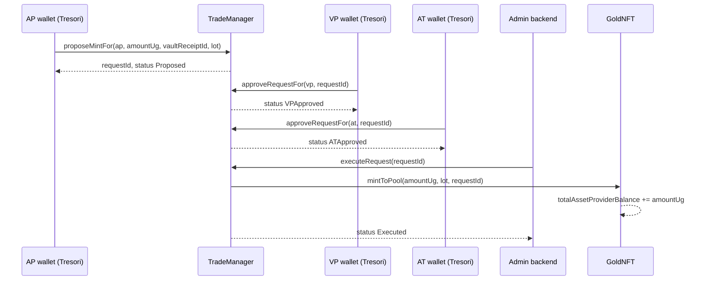

# Frontend Mint Flow — STOEX Gold (Polygon Amoy)

This guide covers **tokenizing vaulted gold into the AP buy pool** via the PRD mint path: **propose → VP approve → AT approve → admin execute**.

Mint is the **only** way to add retail inventory on-chain (there is no `seedPoolInventory`). After mint executes, users can **`createBuyRequestFor`** (see onboarding guide).

---

## Network and deployment

| Item | Value |
|------|-------|
| Chain | Polygon Amoy |
| Chain ID | `80002` |
| Gasless relayer (Tresori) | `0xB9CBD815098cc3d6A348bDfed995af91e2298d6D` |

### Smart contract addresses

| Contract | Address | Role in mint |
|----------|---------|--------------|
| **TradeManager** | `0x11c3048159305517ccEACEBA17531996148324aA` | `proposeMintFor`, `approveRequestFor`, `executeRequest` |
| **GoldNFT** | `0x8C26b220472AB8A8a1627087F3F2612768fA171D` | Pool supply reads |
| **GovernanceConfig** | `0xEc2AaEE5BC7B7967A2c98F59072b9a376202A4a1` | caps, VP toggle, timelock |
| **TimelockController** | `0xF12b3226abeb60930C5Ae9aB86846FE1cc5FBd41` | Optional lot timelock |

ABI: `abi/TradeManager.abi.json`, `abi/GoldNFT.abi.json`.

---

## What mint does on-chain

Mint **does not credit a user wallet**. On `executeRequest`, `TradeManager` calls `GoldNFT.mintToPool`:

| Variable | Change on mint execute |
|----------|------------------------|
| `totalGoldSupply` | **+** `amountUg` |
| `totalAssetProviderBalance` | **+** `amountUg` (AP retail pool) |
| `userHolding[anyone]` | unchanged |
| `circulatingSupply()` | unchanged (0 until users buy) |

**Invariant:** `totalGoldSupply = totalAssetProviderBalance + Σ userHolding`

Retail buys pull from `totalAssetProviderBalance` via `transferFromAPToUser`.

---

## Approval sequence (default policy)

| Step | Who | Function | Role required |
|------|-----|----------|---------------|
| 1 | Asset Provider | `proposeMintFor(ap, ...)` | `AP_ROLE` on `ap` |
| 2 | Verifying Party | `approveRequestFor(vp, requestId)` | `VP_ROLE` on `vp` |
| 3 | Asset Trustee | `approveRequestFor(at, requestId)` | `AT_ROLE` on `at` |
| 4 | Operations admin | `executeRequest(requestId)` | `DEFAULT_ADMIN_ROLE` on `TradeManager` |

Default policy (mint): **VP → AT** (no AP approval step after propose).

If `GovernanceConfig.vpRequiredForApprovals()` is `false`, the VP step is omitted and only **AT** must approve.



### Request lifecycle

| `RequestStatus` | Value | Meaning (mint) |
|-----------------|-------|----------------|
| `Proposed` | `0` | AP proposed; awaiting first approval |
| `VPApproved` | `2` | VP approved (if VP required) |
| `ATApproved` | `4` | Fully approved; ready for admin execute |
| `Executed` | `5` | Mint complete — pool funded |
| `Rejected` / `Expired` / `Cancelled` | `6` / `7` / `8` | Terminal failure states |

`requestType` for mint = **`3`** (`StoexTypes.RequestType.Mint`).

---

## Limits and chunking

| Policy | Default on Amoy | Notes |
|--------|-----------------|-------|
| `maxAmountPerTx` | `1_000_000_000` µg (**1 kg**) | Single `proposeMint` cannot exceed this |
| `requestExpiryDuration` | 7 days | Unapproved requests can be `expireRequest` |
| `defaultTimelockDuration` | `0` | If set > 0, mint lot gets timelock on pool lot id |

**Larger inventory:** run multiple mint flows (e.g. 10 × 1 kg = 10 kg).

**Units:** `1 gram = 1_000_000` µg. Example: 1 g → `amountUg = 1000000`.

---

## Phase 1 — AP propose (frontend, gasless)

**Contract:** `TradeManager`  
**Function:** `proposeMintFor(address ap, uint256 amountUg, bytes32 vaultReceiptId, MintLotMeta lot)`  
**Signer:** relayer relays with `ap` = wallet holding **`AP_ROLE`**

There is **no `creditTo`** parameter — mint always targets the AP pool.

### `MintLotMeta` tuple (field order)

| Index | Field | Type | Notes |
|-------|-------|------|-------|
| 0 | `vaultReceiptId` | `bytes32` | Off-chain vault receipt id (also passed as arg 2) |
| 1 | `batchId` | `bytes32` | Batch / lot reference |
| 2 | `purity` | `uint16` | e.g. `9999` = 99.99% |
| 3 | `depositTimestamp` | `uint256` | Unix timestamp |
| 4 | `apId` | `address` | AP operator address (audit) |
| 5 | `vpId` | `address` | VP address (audit) |
| 6 | `lockUntilTs` | `uint256` | `0` if unused |
| 7 | `amountUg` | `uint256` | Should match `amountUg` arg; overwritten on-chain from arg |

```ts
const amountUg = "1000000"; // 1 g
const vaultReceiptId = "0x..."; // bytes32
const batchId = "0x...";
const purity = 9999;
const depositTs = Math.floor(Date.now() / 1000);
const apId = apMpcWalletAddress;
const vpId = vpMpcWalletAddress;
const lockUntilTs = 0;

await TreSori().writeGaslessMpcSmartContractTransaction({
  contractAddress: "0x11c3048159305517ccEACEBA17531996148324aA",
  functionName: "proposeMintFor",
  params: [
    apMpcWalletAddress,
    amountUg,
    vaultReceiptId,
    [vaultReceiptId, batchId, purity, depositTs, apId, vpId, lockUntilTs, amountUg],
  ],
  abi: [
    "function proposeMintFor(address ap,uint256 amountUg,bytes32 vaultReceiptId,tuple(bytes32 vaultReceiptId,bytes32 batchId,uint16 purity,uint256 depositTimestamp,address apId,address vpId,uint256 lockUntilTs,uint256 amountUg) lot) returns (uint256 requestId)",
  ],
  fromAddress: apMpcWalletAddress,
  chain: selectedChain,
  clientShare,
  sessionId,
  rpcUrl: AMOY_RPC_URL,
});
```

**Capture `requestId`:** parse `RequestCreated` event from the tx receipt, or read `nextRequestId - 1` after the tx mines.

---

## Phase 2 — VP approve (frontend, gasless)

**Function:** `approveRequestFor(address approver, uint256 requestId)`  
**Signer:** relayer relays with `approver` = VP wallet

```ts
await TreSori().writeGaslessMpcSmartContractTransaction({
  contractAddress: TRADE_MANAGER,
  functionName: "approveRequestFor",
  params: [vpMpcWalletAddress, requestId],
  abi: ["function approveRequestFor(address approver,uint256 requestId)"],
  fromAddress: vpMpcWalletAddress,
  chain: selectedChain,
  clientShare,
  sessionId,
  rpcUrl: AMOY_RPC_URL,
});
```

Skip this step when `vpRequiredForApprovals()` is `false`.

---

## Phase 3 — AT approve (frontend, gasless)

**Function:** `approveRequestFor(address approver, uint256 requestId)`  
**Signer:** relayer relays with `approver` = AT wallet

Same shape as Phase 2; use AT MPC `fromAddress`.

After this call, `getRequestStatus(requestId)` should be **`4`** (`ATApproved`).

---

## Phase 4 — Admin execute (secure backend)

**Function:** `executeRequest(uint256 requestId)`  
**Signer:** operations admin (`DEFAULT_ADMIN_ROLE`) — **do not expose in user-facing frontend**

```shell
source .env
cast send $TRADE_MANAGER "executeRequest(uint256)" $REQUEST_ID \
  --rpc-url $AMOY_RPC_URL \
  --private-key $PRIVATE_KEY \
  --legacy \
  --gas-price 35gwei
```

Or admin MPC / HSM via your ops panel.

After execute: status **`5`** (`Executed`); `GoldNFT.totalAssetProviderBalance()` increases by `amountUg`.

---

## Ops verification (`cast` commands)

### Setup

```shell
cd trade-smart-contract
source .env

export REQUEST_ID=1   # mint request id to inspect
```

### 1) Request status and payload

```shell
cast call $TRADE_MANAGER "getRequestStatus(uint256)(uint8)" $REQUEST_ID --rpc-url $AMOY_RPC_URL

cast call $TRADE_MANAGER \
  "getRequest(uint256)((uint8,uint8,address,address,uint256,bytes32,bytes32,string,uint256,uint256,uint256,(bytes32,bytes32,uint16,uint256,address,address,uint256,uint256),bool,uint256,bytes32))" \
  $REQUEST_ID --rpc-url $AMOY_RPC_URL
```

Expected after full flow: status **`5`**. Request type field = **`3`** (Mint).

### 2) AP pool (system buy readiness)

```shell
cast call $GOLD_NFT "totalAssetProviderBalance()(uint256)" --rpc-url $AMOY_RPC_URL
cast call $GOLD_NFT "totalGoldSupply()(uint256)" --rpc-url $AMOY_RPC_URL
cast call $GOLD_NFT "circulatingSupply()(uint256)" --rpc-url $AMOY_RPC_URL
```

After mint: `totalAssetProviderBalance == totalGoldSupply` (if no user buys yet).

### 3) Pool lot metadata

```shell
cast call $GOLD_NFT "getPoolLotIds()(uint256[])" --rpc-url $AMOY_RPC_URL

# Replace LOT_ID with last id from array
cast call $GOLD_NFT "getMintLot(uint256)((bytes32,bytes32,uint16,uint256,address,address,uint256,uint256))" $LOT_ID --rpc-url $AMOY_RPC_URL
```

### 4) Mint policy

```shell
cast call $GOVERNANCE_CONFIG "maxAmountPerTx()(uint256)" --rpc-url $AMOY_RPC_URL
cast call $GOVERNANCE_CONFIG "vpRequiredForApprovals()(bool)" --rpc-url $AMOY_RPC_URL
cast call $GOVERNANCE_CONFIG "defaultTimelockDuration()(uint256)" --rpc-url $AMOY_RPC_URL

# Mint approval policy (RequestType Mint = 3)
cast call $GOVERNANCE_CONFIG "getApprovalPolicy(uint8)(bytes32[])" 3 --rpc-url $AMOY_RPC_URL
```

### 5) Role checks (wallets used in ops UI)

```shell
export AP_WALLET=0x4f30c25BCf96fa0c93e135ED73baA78D5a27999D
export VP_WALLET=0x4f30c25BCf96fa0c93e135ED73baA78D5a27999D
export AT_WALLET=0x4f30c25BCf96fa0c93e135ED73baA78D5a27999D

AP_ROLE=$(cast keccak "AP_ROLE")
VP_ROLE=$(cast keccak "VP_ROLE")
AT_ROLE=$(cast keccak "AT_ROLE")

cast call $TRADE_MANAGER "hasRole(bytes32,address)(bool)" $AP_ROLE $AP_WALLET --rpc-url $AMOY_RPC_URL
cast call $TRADE_MANAGER "hasRole(bytes32,address)(bool)" $VP_ROLE $VP_WALLET --rpc-url $AMOY_RPC_URL
cast call $TRADE_MANAGER "hasRole(bytes32,address)(bool)" $AT_ROLE $AT_WALLET --rpc-url $AMOY_RPC_URL
```

Replace wallet addresses with your Tresori MPC ops wallets.

---

## “Mint complete / ready for buy” checklist

| Check | Expected |
|-------|----------|
| `getRequestStatus(requestId)` | `5` (Executed) |
| `getRequest(requestId).requestType` | `3` (Mint) |
| `totalAssetProviderBalance` | increased by mint `amountUg` |
| `totalGoldSupply` | same increase |
| `circulatingSupply()` | unchanged from pre-mint (unless users already hold gold) |
| `routingConfigured()` on TradeManager | `true` |

Users can buy when **both**:

1. User onboarding checks pass ([onboarding doc](./FRONTEND_USER_ONBOARDING.md))
2. `totalAssetProviderBalance >= buy weightUg`

---

## One-liner ops script (post-mint)

```shell
source .env
export REQUEST_ID=1

echo "=== Request ==="
cast call $TRADE_MANAGER "getRequestStatus(uint256)(uint8)" $REQUEST_ID --rpc-url $AMOY_RPC_URL

echo "=== AP pool ==="
echo -n "totalAssetProviderBalance: "; cast call $GOLD_NFT "totalAssetProviderBalance()(uint256)" --rpc-url $AMOY_RPC_URL
echo -n "totalGoldSupply: "; cast call $GOLD_NFT "totalGoldSupply()(uint256)" --rpc-url $AMOY_RPC_URL
echo -n "circulatingSupply: "; cast call $GOLD_NFT "circulatingSupply()(uint256)" --rpc-url $AMOY_RPC_URL

echo "=== Policy ==="
echo -n "maxAmountPerTx: "; cast call $GOVERNANCE_CONFIG "maxAmountPerTx()(uint256)" --rpc-url $AMOY_RPC_URL
echo -n "vpRequiredForApprovals: "; cast call $GOVERNANCE_CONFIG "vpRequiredForApprovals()(bool)" --rpc-url $AMOY_RPC_URL
```

---

## Script alternative (CLI, full lifecycle)

From repo root with `.env` configured (`TRADE_MANAGER`, role private keys):

```shell
source .env
MINT_AMOUNT_UG=1000000 \
forge script script/MintFlow.s.sol:MintFlow \
  --rpc-url $AMOY_RPC_URL \
  --broadcast \
  --slow \
  --legacy \
  --with-gas-price 35gwei
```

Optional env overrides: `MINT_VAULT_RECEIPT_ID`, `MINT_BATCH_ID`, `MINT_PURITY`, `MINT_DEPOSIT_TS`, `MINT_AP_ID`, `MINT_VP_ID`, `AP_PRIVATE_KEY`, `VP_PRIVATE_KEY`, `AT_PRIVATE_KEY`, `ADMIN_PRIVATE_KEY`.

---

## Events to index (ops dashboard)

| Event | Contract | Use |
|-------|----------|-----|
| `RequestCreated(requestId, requestType, initiator, amountUg, fiatValue)` | TradeManager | New mint proposal; `requestType = 3` |
| `RequestApproved(requestId, role, approver)` | TradeManager | VP / AT milestones |
| `RequestExecuted(requestId, requestType)` | TradeManager | Mint settled |
| `PoolInventoryMinted(amountUg, lotId, requestId)` | GoldNFT | Pool credit confirmation |

---

## Common errors

| Revert | Cause |
|--------|-------|
| `NotApprover` | `approveRequest` signer lacks the next required role |
| `NotFullyApproved` | `executeRequest` called before AT approval |
| `ExceedsMax` | `amountUg > maxAmountPerTx` (default 1 kg) |
| `Expired` | `approveRequest` after `expiresAt` |
| `InsufficientApInventory` | *(on buy, not mint)* pool empty or buy size too large |

---

## Related docs

- [FRONTEND_USER_ONBOARDING.md](./FRONTEND_USER_ONBOARDING.md) — user register / KYC / buy-readiness checks
- [FRONTEND_INTEGRATION_GUIDE.md](./FRONTEND_INTEGRATION_GUIDE.md) — gasless patterns for all operations
- [README.md](../README.md) — deploy, roles, `MintFlow.s.sol`
