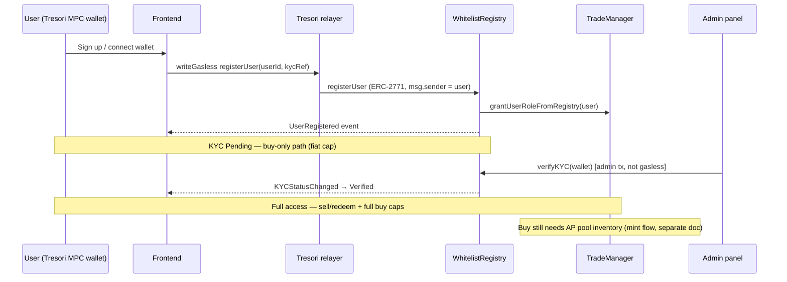

# Frontend User Onboarding — STOEX Gold (Polygon Amoy)

This guide covers **self-service user registration** from the frontend (Tresori gasless), **admin KYC verification**, and **ops `cast` commands** to confirm a wallet is ready to buy.

Mint and buy integration are separate phases; complete onboarding verification before wiring the mint ops panel.

---

## Network and deployment

| Item | Value |
|------|-------|
| Chain | Polygon Amoy |
| Chain ID | `80002` |
| Gasless forwarder (Tresori) | `0x9DE37157464E5Ecf8FD0AB0d88D2B08c3cdfFf6D` |

### Smart contract addresses (current deployment)

| Contract | Address | Role in onboarding |
|----------|---------|-------------------|
| **WhitelistRegistry** | `0xF6f299F574f136873e7Df9D54311AA62d09B9D52` | `registerUser`, `verifyKYC`, eligibility reads |
| **TradeManager** | `0x4AF90173D906021B9B56AA3dE31a0F26Ac44F9F3` | `USER_ROLE` for `createBuyRequest` (phase 2) |
| **GoldNFT** | `0x39E5D9E00bE5EB79332e85811Aa41c3f42Ba6eE7` | Holdings / certificate reads |
| **GovernanceConfig** | `0x0a7B6033e405337fEF5F38254c02DE8354dEDbCa` | Buy limits, non-KYC fiat cap |
| **EscrowVault** | `0xbb40B6f14bfa98322a5aDdc1D5accc92D917c891` | Sell/redeem escrow (post-onboarding) |
| **TimelockController** | `0xdb3Eedb2C1dfb820b3A59d6d349f6620c8474D2E` | Timelocks (post-onboarding) |

ABI files: `abi/WhitelistRegistry.abi.json`, `abi/TradeManager.abi.json` (regenerate after contract changes with `forge inspect`).

---

## End-to-end flow



### KYC tiers

| Stage | `kycStatus` | `isEligible` | `isEligibleForNonKycUser` | Can buy? | Can sell/redeem? |
|-------|-------------|--------------|---------------------------|----------|------------------|
| After `registerUser` | Pending (`0`) | `false` | `true` | Yes, within **non-KYC fiat cap** | No |
| After `verifyKYC` | Verified (`1`) | `true` | `false` | Yes, full caps | Yes |
| After `rejectKYC` | Rejected (`2`) | `false` | `false` | No | No |

Default on-chain non-KYC fiat cap: **50,000,000** minor INR units (e.g. paise — confirm product mapping in UI).

---

## Phase 1 — User self-registration (frontend, gasless)

**Contract:** `WhitelistRegistry`  
**Function:** `registerUser(bytes32 userId, string kycRef)`  
**Signer:** User's Tresori MPC `fromAddress` (wallet is inferred on-chain; do **not** pass a wallet argument).

```ts
import WhitelistRegistryAbi from "../abi/WhitelistRegistry.abi.json";

// userId: stable id from your DB, encoded as bytes32 (see below)
const userIdBytes32 = ethers.id("user-12345"); // or keccak256 of your id string
const kycRef = "KYC-REF-FROM-BACKOFFICE";

await TreSori().writeGaslessMpcSmartContractTransaction({
  contractAddress: "0xF6f299F574f136873e7Df9D54311AA62d09B9D52",
  functionName: "registerUser",
  params: [userIdBytes32, kycRef],
  abi: ["function registerUser(bytes32 userId,string kycRef)"],
  fromAddress: userMpcWalletAddress,
  chain: selectedChain, // Amoy 80002
  clientShare,
  sessionId,
  rpcUrl: AMOY_RPC_URL,
});
```

**On success (same transaction):**

- Profile created with `kycStatus = Pending`
- `USER_ROLE` granted on `WhitelistRegistry` and `TradeManager`
- `UserRegistered(wallet, userId)` event emitted

**`userId` encoding:** use a deterministic `bytes32` from your backend user id, e.g. `ethers.id(backendUserId)` or `keccak256(abi.encodePacked(backendUserId))`. Store the same value in your DB for audit.

**UI reads after register (no gas):**

```ts
const profile = await registry.getProfile(wallet);
const canBuyPending = await registry.isEligibleForNonKycUser(wallet);
const hasUserRole = await registry.hasUserRole(wallet);
```

---

## Phase 2 — Admin KYC verification (backend / admin panel)

**Contract:** `WhitelistRegistry`  
**Function:** `verifyKYC(address wallet)`  
**Signer:** operations admin (`DEFAULT_ADMIN_ROLE`) — **not** gasless; use secure backend key or admin MPC.

```ts
// Admin-only — do not expose private key in frontend
await adminSigner.sendTransaction({
  to: WHITELIST_REGISTRY,
  data: registryInterface.encodeFunctionData("verifyKYC", [userWallet]),
});
```

Optional back-office registration (skip user self-register):  
`adminRegisterUser(bytes32 userId, address wallet, string kycRef)` — same admin signer.

---

## Phase 3 — Ops verification (`cast` commands)

Use these after frontend onboarding to confirm a wallet is ready for **buy** integration.

### Setup

```shell
cd trade-smart-contract
source .env

# Wallet to check (user's MPC / investor address)
export WALLET=0xYourUserWalletAddress
```

### 1) Profile and KYC state

```shell
cast call $WHITELIST_REGISTRY \
  "getProfile(address)((bytes32,address,uint8,uint8,uint8,uint8,string,uint256))" \
  $WALLET --rpc-url $AMOY_RPC_URL
```

Tuple fields: `userId`, `wallet`, `kycStatus`, `walletStatus`, `userStatus`, `riskLevel`, `kycRef`, `registeredAt`.

**`kycStatus`:** `0` = Pending, `1` = Verified, `2` = Rejected.

### 2) Eligibility flags

```shell
# Full platform access (verified KYC)
cast call $WHITELIST_REGISTRY "isEligible(address)(bool)" $WALLET --rpc-url $AMOY_RPC_URL

# Pending-KYC buy-only path
cast call $WHITELIST_REGISTRY "isEligibleForNonKycUser(address)(bool)" $WALLET --rpc-url $AMOY_RPC_URL

# Onboarded investor flag
cast call $WHITELIST_REGISTRY "hasUserRole(address)(bool)" $WALLET --rpc-url $AMOY_RPC_URL
```

### 3) Trade `USER_ROLE` (required for `createBuyRequest`)

```shell
USER_ROLE=$(cast keccak "USER_ROLE")

cast call $TRADE_MANAGER "hasRole(bytes32,address)(bool)" $USER_ROLE $WALLET --rpc-url $AMOY_RPC_URL
cast call $WHITELIST_REGISTRY "hasRole(bytes32,address)(bool)" $USER_ROLE $WALLET --rpc-url $AMOY_RPC_URL
```

### 4) Buy policy limits (for UI validation)

```shell
cast call $GOVERNANCE_CONFIG "minimumBuyGoldValueInUg()(uint256)" --rpc-url $AMOY_RPC_URL
cast call $GOVERNANCE_CONFIG "maxAmountPerTx()(uint256)" --rpc-url $AMOY_RPC_URL
cast call $GOVERNANCE_CONFIG "nonKycMaxBuyFiatAmount()(uint256)" --rpc-url $AMOY_RPC_URL
cast call $GOVERNANCE_CONFIG "dailyBuyCap()(uint256)" --rpc-url $AMOY_RPC_URL
```

### 5) System readiness for buy (AP pool — separate from user onboarding)

Buys revert with `InsufficientApInventory` if the pool is empty. Check before enabling buy in production:

```shell
cast call $GOLD_NFT "totalAssetProviderBalance()(uint256)" --rpc-url $AMOY_RPC_URL
cast call $GOLD_NFT "totalGoldSupply()(uint256)" --rpc-url $AMOY_RPC_URL
cast call $GOLD_NFT "circulatingSupply()(uint256)" --rpc-url $AMOY_RPC_URL
```

Pool must be **≥ buy amount in µg** (`1 gram = 1_000_000 µg`). Inventory enters via **mint flow** (`proposeMint` → approvals → `executeRequest`), not user onboarding.

### 6) Gasless wiring sanity check

```shell
cast call $WHITELIST_REGISTRY "trustedForwarder()(address)" --rpc-url $AMOY_RPC_URL
cast call $TRADE_MANAGER "trustedForwarder()(address)" --rpc-url $AMOY_RPC_URL
cast call $TRADE_MANAGER "routingConfigured()(bool)" --rpc-url $AMOY_RPC_URL
```

Expected forwarder: `0x9DE37157464E5Ecf8FD0AB0d88D2B08c3cdfFf6D`.  
Expected `routingConfigured`: `true`.

---

## “Ready to buy” checklist (per wallet)

Run the commands above. A wallet is **user-ready** when:

| Check | Pending KYC (buy-only) | Verified KYC (full) |
|-------|------------------------|---------------------|
| `getProfile(...).registeredAt` | `> 0` | `> 0` |
| `hasUserRole(wallet)` | `true` | `true` |
| `hasRole(USER_ROLE)` on TradeManager | `true` | `true` |
| `isEligibleForNonKycUser` | `true` | `false` |
| `isEligible` | `false` | `true` |
| `kycStatus` | `0` (Pending) | `1` (Verified) |

A wallet is **system-ready for buy** when additionally:

| Check | Expected |
|-------|----------|
| `GoldNFT.totalAssetProviderBalance()` | `>=` intended buy size (µg) |
| `TradeManager.routingConfigured()` | `true` |

Until mint funds the AP pool, onboarding can succeed but **`createBuyRequest` will still revert**.

---

## One-liner ops script (copy/paste)

Replace `WALLET` and run from repo root after `source .env`:

```shell
export WALLET=0xYourUserWalletAddress
USER_ROLE=$(cast keccak "USER_ROLE")

echo "=== Profile ==="
cast call $WHITELIST_REGISTRY "getProfile(address)((bytes32,address,uint8,uint8,uint8,uint8,string,uint256))" $WALLET --rpc-url $AMOY_RPC_URL

echo "=== Eligibility ==="
echo -n "isEligible: "; cast call $WHITELIST_REGISTRY "isEligible(address)(bool)" $WALLET --rpc-url $AMOY_RPC_URL
echo -n "isEligibleForNonKycUser: "; cast call $WHITELIST_REGISTRY "isEligibleForNonKycUser(address)(bool)" $WALLET --rpc-url $AMOY_RPC_URL
echo -n "hasUserRole: "; cast call $WHITELIST_REGISTRY "hasUserRole(address)(bool)" $WALLET --rpc-url $AMOY_RPC_URL

echo "=== USER_ROLE ==="
echo -n "TradeManager: "; cast call $TRADE_MANAGER "hasRole(bytes32,address)(bool)" $USER_ROLE $WALLET --rpc-url $AMOY_RPC_URL
echo -n "Registry: "; cast call $WHITELIST_REGISTRY "hasRole(bytes32,address)(bool)" $USER_ROLE $WALLET --rpc-url $AMOY_RPC_URL

echo "=== Buy policy ==="
echo -n "nonKycMaxBuyFiatAmount: "; cast call $GOVERNANCE_CONFIG "nonKycMaxBuyFiatAmount()(uint256)" --rpc-url $AMOY_RPC_URL
echo -n "minimumBuyGoldValueInUg: "; cast call $GOVERNANCE_CONFIG "minimumBuyGoldValueInUg()(uint256)" --rpc-url $AMOY_RPC_URL
echo -n "maxAmountPerTx: "; cast call $GOVERNANCE_CONFIG "maxAmountPerTx()(uint256)" --rpc-url $AMOY_RPC_URL

echo "=== AP pool (system buy readiness) ==="
echo -n "totalAssetProviderBalance: "; cast call $GOLD_NFT "totalAssetProviderBalance()(uint256)" --rpc-url $AMOY_RPC_URL
echo -n "totalGoldSupply: "; cast call $GOLD_NFT "totalGoldSupply()(uint256)" --rpc-url $AMOY_RPC_URL
```

---

## Admin: verify KYC from CLI (optional)

If the user registered via frontend but admin panel is not ready:

```shell
source .env
cast send $WHITELIST_REGISTRY "verifyKYC(address)" $WALLET \
  --rpc-url $AMOY_RPC_URL \
  --private-key $PRIVATE_KEY
```

Requires admin `DEFAULT_ADMIN_ROLE` on `WhitelistRegistry`.

---

## What comes next (mint → buy)

1. **Mint flow (ops):** see **[FRONTEND_MINT_FLOW.md](./FRONTEND_MINT_FLOW.md)** — `proposeMint` → VP → AT → admin `executeRequest`; credits AP buy pool.
2. **Buy flow (user, gasless):** `createBuyRequest(weightUg, fiat_value, payment_ref, txDetailsHash)` — auto-executes in one tx; requires onboarded `USER_ROLE` + pool inventory.

See `README.md` §7 and `docs/FRONTEND_INTEGRATION_GUIDE.md` for buy payloads.

---

## Related docs

- [FRONTEND_INTEGRATION_GUIDE.md](./FRONTEND_INTEGRATION_GUIDE.md) — gasless patterns for all operations
- [FRONTEND_USER_ONBOARDING.md](./FRONTEND_USER_ONBOARDING.md) — user onboarding
- [FRONTEND_MINT_FLOW.md](./FRONTEND_MINT_FLOW.md) — mint ops / AP pool
- [SMART_CONTRACTS_OVERVIEW.md](./SMART_CONTRACTS_OVERVIEW.md) — contract surface reference
- [README.md](../README.md) — deploy, roles, script flows
